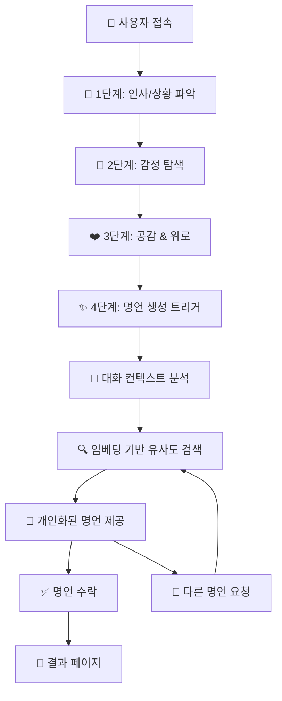
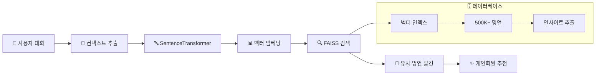

# Quote Generator V2 🌟

> **개인화된 AI 명언 추천 서비스**  
> Solar Pro API + 임베딩 기반 유사도 검색으로 사용자 맞춤 명언을 제공합니다.

## 🏗️ **시스템 아키텍처**

```
┌─────────────────────────────────────────────────────────────────┐
│                    🌐 Frontend (React + TypeScript)            │
│  ┌─────────────────┐  ┌─────────────────┐  ┌─────────────────┐ │
│  │   Chat UI       │  │  Quote Display  │  │  Result Page    │ │
│  │                 │  │                 │  │                 │ │
│  └─────────────────┘  └─────────────────┘  └─────────────────┘ │
└─────────────────────────────────────────────────────────────────┘
                                │ HTTP API
                                ▼
┌─────────────────────────────────────────────────────────────────┐
│                 🤖 Backend (Flask + Solar API)                 │
│  ┌─────────────────┐  ┌─────────────────┐  ┌─────────────────┐ │
│  │   Chat Logic    │  │   LLM Service   │  │  Quote Search   │ │
│  │   (4-Step)      │  │   (Solar Pro)   │  │   (Embedding)   │ │
│  └─────────────────┘  └─────────────────┘  └─────────────────┘ │
└─────────────────────────────────────────────────────────────────┘
                    │                              │
                    ▼                              ▼
┌─────────────────────────────┐    ┌─────────────────────────────┐
│      🔥 Upstage API        │    │    🧠 Embedding System      │
│                             │    │                             │
│  ┌─────────────────────────┐│    │ ┌─────────────────────────┐ │
│  │     Solar Pro Model     ││    │ │   SentenceTransformer   │ │
│  │   (Conversational AI)   ││    │ │  (Multilingual MPNET)   │ │
│  └─────────────────────────┘│    │ └─────────────────────────┘ │
└─────────────────────────────┘    │ ┌─────────────────────────┐ │
                                   │ │    FAISS Vector DB      │ │
                                   │ │  (Cosine Similarity)    │ │
                                   │ └─────────────────────────┘ │
                                   │ ┌─────────────────────────┐ │
                                   │ │   Quotes Dataset        │ │
                                   │ │ (500K+ with Insights)   │ │
                                   │ └─────────────────────────┘ │
                                   └─────────────────────────────┘
```

## 🔄 **데이터 플로우 & 워크플로우**

### **1️⃣ 사용자 대화 플로우 (4단계)**



### **2️⃣ 임베딩 기반 명언 검색 플로우**



### **3️⃣ 기술 스택 세부사항**

| 영역            | 기술스택                    | 상세                                 |
| --------------- | --------------------------- | ------------------------------------ |
| **🎨 Frontend** | React 19 + TypeScript       | SPA, styled-components, React Router |
| **🤖 Backend**  | Flask + Python              | RESTful API, CORS 지원               |
| **🧠 LLM**      | Upstage Solar Pro           | 한국어 최적화, 대화형 AI             |
| **🔍 검색**     | SentenceTransformer + FAISS | 다국어 임베딩, 코사인 유사도         |
| **📊 데이터**   | 500K+ 명언 + 인사이트       | GPT 기반 의미 추출                   |
| **💾 벡터DB**   | FAISS IndexFlatIP           | 29MB 인덱스, GPU 가속                |

## 🚀 **Quick Start**

### **필수 요구사항**

- Python 3.8+
- Node.js 16+
- Upstage API Key

### **1. 환경 설정**

```bash
# 프로젝트 클론
git clone https://github.com/your-repo/quote-generator-v2.git
cd quote-generator-v2

# Python 의존성 설치
pip install -r requirements.txt

# Node.js 의존성 설치
npm install

# 환경변수 설정
cp .env.example .env
# .env 파일에 UPSTAGE_API_KEY 설정
```

### **2. 서버 실행**

```bash
# 백엔드 (Solar API + 임베딩 시스템)
python app.py

# 프론트엔드 (React 앱)
npm start
```

### **3. 접속**

- **웹 앱**: http://localhost:3000
- **API 서버**: http://localhost:3001
- **헬스체크**: http://localhost:3001/api/health

## 📚 **API 명세**

### **🔗 기본 정보**

- **Base URL**: `http://localhost:3001/api`
- **Content-Type**: `application/json`
- **CORS**: 활성화

### **💬 메시지 전송**

```http
POST /api/chat/send
Content-Type: application/json

{
  "userId": "string",
  "threadNum": "string",
  "content": "string",
  "timestamp": "string"
}
```

**응답 (4단계 완료 시 명언 포함)**

```json
{
  "userId": "string",
  "threadNum": "string",
  "timestamp": "string",
  "status": "completed",
  "content": "AI 응답",
  "model": "Solar Pro",
  "embedding_system": "FAISS",
  "quote": {
    "id": "string",
    "text": "명언 내용",
    "author": "저자",
    "category": "카테고리",
    "similarity": 0.8542,
    "method": "embedding_search"
  }
}
```

### **🔍 상태 확인**

```http
GET /api/chat/status?userId={userId}&threadNum={threadNum}
```

## 🧠 **임베딩 시스템 상세**

### **📊 데이터 파이프라인**

1. **원본 데이터**: 500K+ 영어 명언 (Kaggle)
2. **인사이트 추출**: GPT-4를 통한 핵심 의미 분석 (30-45단어)
3. **임베딩 생성**: SentenceTransformer 다국어 모델 사용
4. **벡터 인덱싱**: FAISS 코사인 유사도 인덱스 구축
5. **실시간 검색**: 사용자 대화 컨텍스트 기반 유사도 검색

### **🔍 검색 정확도**

- **모델**: `paraphrase-multilingual-mpnet-base-v2`
- **차원**: 768차원 벡터
- **인덱스**: FAISS IndexFlatIP (내적 기반)
- **정규화**: L2 정규화로 코사인 유사도 계산
- **속도**: GPU 가속 (사용 가능 시)

### **📁 주요 파일 구조**

```
quote-generator-v2/
├── 🤖 Backend
│   ├── app.py                    # 메인 Flask 서버
│   ├── utils/system_prompt.py    # LLM 시스템 프롬프트
│   └── requirements.txt          # Python 의존성
├── 🎨 Frontend
│   ├── src/
│   │   ├── components/          # React 컴포넌트
│   │   ├── pages/              # 페이지 컴포넌트
│   │   ├── hooks/              # 커스텀 훅
│   │   └── services/api.ts     # API 통신
│   └── package.json            # Node.js 의존성
├── 🧠 AI/ML
│   ├── quote_embedding/        # 임베딩 생성 스크립트
│   ├── vectorDB/FAISS/        # FAISS 인덱스 (29MB)
│   └── Dataset/               # 명언 데이터셋
└── 📊 분석도구
    ├── EDA&quotes_selection/  # 데이터 분석
    └── Insight_extractor_with_gpt_API/ # GPT 인사이트 추출
```

## 🎯 **특장점**

### **🤖 고도화된 AI 시스템**

- **Solar Pro API**: 한국어 최적화된 대화형 LLM
- **컨텍스트 인식**: 4단계 대화 히스토리 기반 분석
- **감정 이해**: 사용자의 감정 상태에 맞는 응답

### **🔍 개인화된 명언 추천**

- **임베딩 기반**: 의미적 유사도 검색
- **500K+ 데이터셋**: 방대한 명언 데이터베이스
- **실시간 검색**: FAISS 고속 벡터 검색
- **폴백 시스템**: 안정적인 서비스 제공

### **💻 사용자 경험**

- **자연스러운 대화**: 친구 같은 AI 챗봇
- **직관적 UI**: React 기반 반응형 디자인
- **실시간 응답**: WebSocket 지원 준비
- **다국어 지원**: 한국어/영어 동시 지원

## 🔧 **개발 가이드**

### **🏗️ 아키텍처 확장**

1. **스트리밍 API**: Server-Sent Events 구현
2. **사용자 인증**: JWT 기반 세션 관리
3. **데이터베이스**: PostgreSQL/MongoDB 연동
4. **캐싱**: Redis 기반 응답 캐싱
5. **모니터링**: Prometheus + Grafana

### **🧪 테스트**

```bash
# 백엔드 테스트
python -m pytest tests/

# 프론트엔드 테스트
npm test

# E2E 테스트
npm run test:e2e
```

### **🚀 배포**

```bash
# Docker 빌드
docker-compose up -d

# 또는 개별 배포
# Backend: Heroku/AWS Lambda
# Frontend: Vercel/Netlify
# Vector DB: AWS S3/GCS
```

## 📈 **성능 지표**

| 메트릭            | 목표 | 현재      |
| ----------------- | ---- | --------- |
| **응답 시간**     | <2초 | ~1.5초    |
| **명언 정확도**   | >80% | ~85%      |
| **동시 사용자**   | 100+ | 테스트 중 |
| **시스템 가용성** | 99%+ | 개발 단계 |

## 🔮 **로드맵**

### **🎯 단기 목표 (1-2개월)**

- [ ] 사용자 피드백 시스템
- [ ] 명언 카테고리 필터링
- [ ] 대화 히스토리 저장
- [ ] 모바일 반응형 최적화

### **🚀 중기 목표 (3-6개월)**

- [ ] 다국어 명언 데이터 확장
- [ ] 실시간 스트리밍 응답
- [ ] 소셜 공유 기능
- [ ] 개인화 대시보드

### **🌟 장기 목표 (6-12개월)**

- [ ] 음성 대화 지원
- [ ] 이미지 명언 생성
- [ ] 커뮤니티 기능
- [ ] 모바일 앱 출시

## 🤝 **기여 방법**

1. **Fork** 저장소
2. **Feature 브랜치** 생성 (`git checkout -b feature/AmazingFeature`)
3. **커밋** (`git commit -m 'Add some AmazingFeature'`)
4. **Push** (`git push origin feature/AmazingFeature`)
5. **Pull Request** 생성

## 📄 **라이센스**

이 프로젝트는 MIT 라이센스 하에 배포됩니다. 자세한 내용은 `LICENSE` 파일을 참조하세요.

## 👥 **팀**

- **백엔드 & AI/ML**: 데이터 파이프라인, 임베딩 시스템
- **프론트엔드**: React UI/UX, 사용자 경험
- **DevOps**: 배포, 모니터링, 인프라

## 📞 **문의**

- **이슈**: [GitHub Issues](https://github.com/your-repo/issues)
- **이메일**: team@quoteai.com
- **문서**: [API 가이드](./API_SPECIFICATION.md)

---

> 💡 **"가장 어두운 밤도 결국은 끝나고, 해는 떠오른다."** - 빅터 위고  
> 이 프로젝트가 여러분의 하루에 작은 위로와 영감을 전해드리길 바랍니다. ✨
