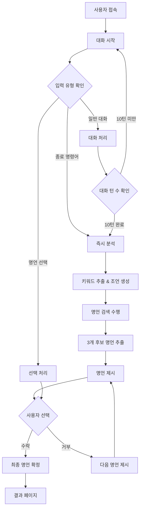

# 딱 맞는 말 - 당신의 하루에 딱 맞는 한 마디 

> **개인화된 AI 명언 추천 서비스**  
> 사용자의 감정에 진심으로 공감하고, 적절한 한마디를 통해 따뜻한 위로와 영감을 제공하는 챗봇 서비스입니다.


---

## 👥 팀원 소개

| 이름 | 역할 | 연락처 |
|------|------|--------|
| **정다훈** | 팀장, 프론트엔드 | jdh251425142514@gmail.com |
| **김천지** | 챗봇 | 202210911@sangmyung.kr |
| **이연우** | 챗봇 | amyamy7365@gmail.com |
| **임가윤** | 프론트엔드 | gayunyim@gmail.com |
| **최윤정** | 디자이너 | 0311yunjung@gmail.com |

---

##  프로젝트 소개

**딱 맞는 말**은 사용자의 감정에 진심으로 공감하고, 적절한 한마디를 통해 따뜻한 위로와 영감을 제공하는 챗봇 서비스입니다.


### 🎨 서비스 특징

- **10턴 기반 대화 분석**: 충분한 대화를 통해 사용자의 상황과 감정을 깊이 있게 파악
- **AI 기반 개인화 추천**: LangGraph 워크플로우로 구성된 체계적인 대화 분석 시스템
- **벡터 유사도 검색**: 50만 개 명언 데이터베이스에서 사용자 상황에 가장 적합한 명언 추천
- **사용자 선택권 제공**: 3개의 후보 명언 중 사용자가 직접 선택할 수 있는 인터랙티브 시스템

---

## 💡 주제 선정 계기

정보와 조언이 넘치는 요즘, 많은 말보다는 상황에 맞는 한 줄이 더 위로가 될 수 있다는 점에서 사용자 맞춤형 한 마디를 전해주는 챗봇을 기획했습니다.


---

## 📊 활용 데이터

### 🎯 주요 데이터셋
- **명언 데이터**: [Kaggle Quotes 500K Dataset](https://www.kaggle.com/datasets/manann/quotes-500k)
- **데이터 규모**: 원본 50만 개 → 정제 후 1만 개 고품질 명언

---

## 🤖 사용 모델

### 💬 대화 AI 모델
- **모델명**: UpStage Solar-Pro API
- **특징**: 한국어 최적화, 대화형 AI, 높은 성능
- **용도**: 사용자와의 자연스러운 대화, 감정 분석, 상황 파악

### 🧠 임베딩 모델
- **모델명**: [sentence-transformers/paraphrase-multilingual-mpnet-base-v2](https://huggingface.co/sentence-transformers/paraphrase-multilingual-mpnet-base-v2)
- **특징**: 다국어 지원, 768차원 벡터, 높은 의미 이해 성능
- **용도**: 대화 내용과 명언 인사이트 간 유사도 계산

### 🔍 벡터 검색 엔진
- **엔진**: FAISS (Facebook AI Similarity Search)
- **알고리즘**: IndexFlatIP (코사인 유사도 기반)
- **성능**: CPU 기반 안정적 검색, 폴백 시스템 지원

---

## ⚙️ 기능 소개

### 📝 데이터 전처리
- **원본 데이터 정제**: 토큰 길이 5~42 범위로 적절한 명언 선별
- **고품질 샘플 추출**: 50만 개 → 1만 개 고품질 명언 샘플링
- **GPT-4 인사이트 추출**: 각 명언의 핵심 의미를 30-45단어로 요약

### 🧠 임베딩 시스템
- **SentenceTransformer 활용**: 다국어 모델을 통한 768차원 벡터 생성
- **FAISS 벡터 데이터베이스**: 코사인 유사도 기반 고속 검색 시스템
- **로컬 모델 캐싱**: 네트워크 의존성 제거, 안정적인 서비스 제공

### 🤖 챗봇 시스템
- **LangGraph 워크플로우**: Solar Pro API 기반 체계적인 대화 상태 관리
- **10턴 기반 분석**: 충분한 대화 후 사용자 상황과 감정 분석 (또는 종료 명령어로 즉시 분석)
- **AI 조언 생성**: 개인화된 조언과 핵심 키워드 자동 추출
- **명언 검색 및 추천**: 벡터 검색과 폴백 시스템을 통한 안정적인 명언 추천
- **인터랙티브 명언 선택**: 사용자가 3개 후보 명언을 순환하며 선택 가능
- **종료 명령어 지원**: 'quit', 'exit', '종료' 입력 시 즉시 분석 시작

### 🎨 프론트엔드 시스템
- **React + TypeScript**: 현대적이고 타입 안전한 UI/UX 구현
- **반응형 디자인**: 모바일부터 데스크톱까지 최적화된 채팅 인터페이스
- **커스텀 훅**: 재사용 가능한 상태 관리 및 API 통신 로직
- **다양한 페이지**: 서비스 소개, 분석 방법, 디자인 시스템 등 포괄적 구성

---

## 🔄 시스템 플로우



---

## 📱 명언 결과 예시

서비스를 통해 생성되는 결과물의 예시입니다:


### 🎯 결과물 특징
- **개인화된 조언**: 대화 분석을 바탕으로 한 맞춤형 메시지
- **선별된 명언**: 사용자 상황에 적합한 위로와 영감의 한마디  
- **감성적 디자인**: 따뜻하고 아름다운 시각적 표현
- **키워드 기반**: 대화에서 추출된 핵심 키워드 반영

---

## 🚀 새로운 기능

- **실제 API 통신**: 백엔드 서버와 RESTful API 통신
- **실시간 폴링**: 3초 간격으로 응답 상태 확인
- **스트리밍 지원**: 토큰 단위 실시간 응답 (Server-Sent Events)
- **에러 처리**: 네트워크 오류 시 자동 폴백
- **개발 모드**: API 서버 없이도 모의 응답 제공
- **Upstage API 연동**: 실제 AI 모델을 통한 대화 생성
- **멀티턴 그래프**: LangGraph를 통한 멀티턴 대화 관리
- **모듈화된 아키텍처**: LLMChainBuilder, QuoteManager, ConversationHelper 클래스
- **안정적인 명언 시스템**: 벡터 검색 실패 시 카테고리별 폴백 명언 제공
- **유연한 분석 트리거**: 10턴 완료 또는 사용자 종료 명령어

---

## 📋 프로젝트 구조

### 웹 애플리케이션 (Frontend)

- React 19 + TypeScript 기반
- 대화형 채팅 인터페이스
- 실시간 API 통신

### 챗봇 시스템 (Backend)

- Python 기반 챗봇 클래스
- Upstage API 연동
- LangGraph를 통한 상태 관리

---

## 🛠 설치 및 실행

### 1. 환경 설정

```bash
# Python 가상환경 생성 및 활성화
python -m venv .venv
source .venv/bin/activate  # Linux/Mac
# 또는
.venv\Scripts\activate  # Windows

# Python 패키지 설치
pip install -r requirements.txt

# Node.js 의존성 설치
npm install
```

### 2. 환경 변수 설정

프로젝트 루트에 `.env` 파일을 생성:

```bash
# Upstage API 설정
UPSTAGE_API_KEY=your_upstage_api_key_here

# 웹 애플리케이션 설정
REACT_APP_API_BASE_URL=http://localhost:3001/api
REACT_APP_ENABLE_STREAMING=true
REACT_APP_DEV_MODE=true
```

### 3. 개발 서버 실행

#### 옵션 A: 전체 시스템 실행

```bash
# 1. Flask 서버 실행 (터미널 1)
python app.py

# 2. React 앱 실행 (터미널 2)
npm start
```

#### 옵션 B: 모의 API 서버와 함께 실행

```bash
npm run dev
```

---

## 📝 API 구조

### 1. 메시지 전송 (POST)

```
POST /api/chat/send
```

**요청 형식:**

```json
{
  "userId": "user_1735123456789_abc123",
  "threadNum": "thread_1735123456789_def456",
  "content": "오늘 지하철에서 넘어져서 기분이 안 좋아요",
  "timestamp": "2024-01-15T10:30:00.000Z"
}
```

**응답 형식:**

```json
{
  "userId": "user_1735123456789_abc123",
  "threadNum": "thread_1735123456789_def456",
  "timestamp": "2024-01-15T10:30:05.000Z",
  "status": "pending", // "completed" | "pending" | "error"
  "content": "우선, 괜찮으세요? 많이 다치진 않으셨죠?",
  "quote": {
    "id": "1",
    "text": "가장 어두운 밤도 결국은 끝나고, 해는 떠오른다.",
    "author": "빅터 위고",
    "category": "hope"
  }
}
```

### 2. 상태 확인 (GET)

```
GET /api/chat/status?userId={userId}&threadNum={threadNum}
```

### 3. 스트리밍 (Server-Sent Events)

```
GET /api/chat/stream?userId={userId}&threadNum={threadNum}
```

---

## 🤖 챗봇 시스템

### 클래스 기반 사용법

```python
from utils.chatbot_utils import Chatbot

# 챗봇 인스턴스 생성
chatbot = Chatbot(
    model="solar-pro",
    temperature=0.7,
    max_tokens=512
)

# 대화 시작
response = chatbot.chat_once("안녕하세요!")
print(response)

# 대화 히스토리 확인
chatbot.show_history()

# CSV로 저장
chatbot.save_chat_history_to_csv("chat_log.csv")
```

### 멀티턴 그래프 시스템

LangGraph를 사용한 상태 관리:

```python
# graph.ipynb 참조
class ChatbotState(TypedDict):
    user_id: str
    thread_num: str
    user_message: str
    chatbot_message: str
    timestamp: str
    chat_history: ChatMessageHistory
    status: str
    quote: str
    author: str
```

---

## 📁 파일 구조

```
src/
├── components/
│   ├── Chat/
│   │   ├── ChatBubble.tsx       # 채팅 말풍선
│   │   └── ChatInput.tsx        # 메시지 입력
│   ├── Common/
│   └── Layout/
├── hooks/
│   └── useChat.ts               # 채팅 로직 & API 통신
├── services/
│   └── api.ts                   # API 서비스 함수들
├── types/
│   └── index.ts                 # TypeScript 타입 정의
└── pages/
    └── QuoteGenerator.tsx       # 메인 채팅 페이지

utils/
├── chatbot_utils.py             # 챗봇 클래스
├── system_prompt.py             # 시스템 프롬프트
├── summarize_prompt.py          # 요약 프롬프트
└── __init__.py

notebooks/
├── graph.ipynb                  # LangGraph 구현
├── chatbot_conversation.ipynb   # 대화 테스트
└── chatbot_example.ipynb        # 예제 코드
```

---

## 🔍 API 테스트

### 1. 서버 상태 확인

```bash
curl http://localhost:3001/api/health
```

### 2. 메시지 전송 테스트

```bash
curl -X POST http://localhost:3001/api/chat/send \
  -H "Content-Type: application/json" \
  -d '{
    "userId": "test_user",
    "threadNum": "test_thread",
    "content": "오늘 기분이 안 좋아요",
    "timestamp": "2024-01-15T10:30:00.000Z"
  }'
```

### 3. 상태 확인 테스트

```bash
curl "http://localhost:3001/api/chat/status?userId=test_user&threadNum=test_thread"
```

---

## 🎯 주요 특징

- **자동 ID 생성**: 사용자 ID와 스레드 번호 자동 생성
- **연결 관리**: 컴포넌트 언마운트 시 폴링/스트리밍 연결 자동 해제
- **에러 복구**: API 오류 시 개발 모드에서 모의 응답 제공
- **반응형 UI**: 모바일 친화적인 디자인
- **타입 안전**: TypeScript로 완전한 타입 정의
- **대화 히스토리 관리**: ChatMessageHistory를 통한 대화 기록
- **유연한 분석 조건**: 10턴 완료 또는 종료 명령어('quit', 'exit', '종료')

---

## 🛠 기술 스택

### Frontend

- React 19, TypeScript
- Styled Components
- Fetch API, Server-Sent Events
- React Hooks (useState, useCallback, useEffect)

### Backend & AI

- Python 3.8+
- LangChain & LangGraph
- Upstage API (Solar-Pro)
- Flask (API 서버)
- ChatMessageHistory (대화 관리)

### Development Tools

- 모의 API 서버 (Express.js)
- Jupyter Notebook (개발 및 테스트)
- CSV 로깅 시스템

---

## 🔧 실제 API 서버 연동

모의 서버 대신 실제 API 서버를 사용하려면:

1. `.env` 파일의 `UPSTAGE_API_KEY` 설정
2. Flask 서버에서 실제 Upstage API 사용
3. 자세한 API 명세는 `API_GUIDE.md` 참조

---

## 📚 추가 문서

- [API_GUIDE.md](./API_GUIDE.md) - 상세한 API 명세서
- [API_SPECIFICATION.md](./API_SPECIFICATION.md) - API 규격 문서
- [mock-server.js](./mock-server.js) - 모의 서버 구현 예시

---

## 📄 라이선스

MIT License

---

> 💡 **"가장 어두운 밤도 결국은 끝나고, 해는 떠오른다."** - 빅터 위고  
> 이 프로젝트가 여러분의 하루에 작은 위로와 영감을 전해드리길 바랍니다. ✨
