# Quote Generator V2 🌟

> **개인화된 AI 명언 추천 서비스**  
> Solar Pro API + 임베딩 기반 유사도 검색으로 사용자 맞춤 명언을 제공합니다.

## 🏗️ **시스템 아키텍처**

```
┌─────────────────────────────────────────────────────────────────┐
│                    🌐 Frontend (React + TypeScript)            │
│  ┌─────────────────┐  ┌─────────────────┐  ┌─────────────────┐ │
│  │   Chat UI       │  │  Quote Display  │  │  Result Page    │ │
│  │                 │  │                 │  │                 │ │
│  └─────────────────┘  └─────────────────┘  └─────────────────┘ │
└─────────────────────────────────────────────────────────────────┘
                                │ HTTP API
                                ▼
┌─────────────────────────────────────────────────────────────────┐
│                 🤖 Backend (Flask + Solar API)                 │
│  ┌─────────────────┐  ┌─────────────────┐  ┌─────────────────┐ │
│  │   Chat Logic    │  │   LLM Service   │  │  Quote Search   │ │
│  │   (4-Step)      │  │   (Solar Pro)   │  │   (Embedding)   │ │
│  └─────────────────┘  └─────────────────┘  └─────────────────┘ │
└─────────────────────────────────────────────────────────────────┘
                    │                              │
                    ▼                              ▼
┌─────────────────────────────┐    ┌─────────────────────────────┐
│      🔥 Upstage API        │    │    🧠 Embedding System      │
│                             │    │                             │
│  ┌─────────────────────────┐│    │ ┌─────────────────────────┐ │
│  │     Solar Pro Model     ││    │ │   SentenceTransformer   │ │
│  │   (Conversational AI)   ││    │ │  (Multilingual MPNET)   │ │
│  └─────────────────────────┘│    │ └─────────────────────────┘ │
└─────────────────────────────┘    │ ┌─────────────────────────┐ │
                                   │ │    FAISS Vector DB      │ │
                                   │ │  (Cosine Similarity)    │ │
                                   │ └─────────────────────────┘ │
                                   │ ┌─────────────────────────┐ │
                                   │ │   Quotes Dataset        │ │
                                   │ │ (500K+ with Insights)   │ │
                                   │ └─────────────────────────┘ │
                                   └─────────────────────────────┘
```

## 🔄 **데이터 플로우 & 워크플로우**

### **1️⃣ 사용자 대화 플로우 (4단계)**

```mermaid
graph TD
    A[👤 사용자 접속] --> B[💬 1단계: 인사/상황 파악]
    B --> C[🤝 2단계: 감정 탐색]
    C --> D[❤️ 3단계: 공감 & 위로]
    D --> E[✨ 4단계: 명언 생성 트리거]

    E --> F[🧠 대화 컨텍스트 분석]
    F --> G[🔍 임베딩 기반 유사도 검색]
    G --> H[📜 개인화된 명언 제공]

    H --> I[✅ 명언 수락]
    H --> J[🔄 다른 명언 요청]

    I --> K[🎯 결과 페이지]
    J --> G
```



### **2️⃣ 임베딩 기반 명언 검색 플로우**

```mermaid
graph LR
    A[👤 사용자 대화] --> B[📝 컨텍스트 추출]
    B --> C[🔤 SentenceTransformer]
    C --> D[📊 벡터 임베딩]
    D --> E[🔍 FAISS 검색]
    E --> F[📜 유사 명언 발견]
    F --> G[✨ 개인화된 추천]

    subgraph "🗄️ 데이터베이스"
        H[500K+ 명언]
        I[인사이트 추출]
        J[벡터 인덱스]
    end

    E --> J
    J --> H
    H --> I
```



### **3️⃣ 기술 스택 세부사항**

| 영역            | 기술스택                    | 상세                                 |
| --------------- | --------------------------- | ------------------------------------ |
| **🎨 Frontend** | React 19 + TypeScript       | SPA, styled-components, React Router |
| **🤖 Backend**  | Flask + Python              | RESTful API, CORS 지원               |
| **🧠 LLM**      | Upstage Solar Pro           | 한국어 최적화, 대화형 AI             |
| **🔍 검색**     | SentenceTransformer + FAISS | 다국어 임베딩, 코사인 유사도         |
| **📊 데이터**   | 500K+ 명언 + 인사이트       | GPT 기반 의미 추출                   |
| **💾 벡터DB**   | FAISS IndexFlatIP           | 29MB 인덱스, GPU 가속                |

## 🚀 **환경 설정 및 실행 가이드**

### **필수 요구사항**

- **Python 3.8+ (3.11 권장)**
- **Node.js 16+ (18 LTS 권장)**
- **Upstage API Key** ([https://console.upstage.ai](https://console.upstage.ai)에서 발급)

### **⚠️ 중요 알림**
팀원들이 자주 겪는 문제들을 미리 방지하기 위한 가이드입니다. 순서대로 따라하시면 문제없이 실행됩니다.

---

## **1️⃣ 프로젝트 클론**

```bash
git clone https://github.com/your-repo/Perfect_Quote-1.git
cd Perfect_Quote-1
```

## **2️⃣ Python 환경 설정**

### **Python 패키지 설치**
```bash
# 가상환경 생성 (권장)
python -m venv .venv

# 가상환경 활성화
# Windows:
.venv\Scripts\activate
# macOS/Linux:
source .venv/bin/activate

# 패키지 설치
pip install -r requirements.txt
```

### **로컬 임베딩 모델 다운로드**
```bash
# 임베딩 모델 사전 다운로드 (약 2-3분 소요)
python download_models.py
```

**✅ 출력 예시:**
```
🚀 임베딩 모델 다운로드 시작
1. sentence-transformers/all-MiniLM-L6-v2
   ✅ 다운로드 완료 (15.0초)
2. sentence-transformers/paraphrase-multilingual-mpnet-base-v2  
   ✅ 다운로드 완료 (13.0초)
🎉 모델 다운로드 완료!
```

## **3️⃣ 환경 변수 설정**

### **.env 파일 생성**
```bash
# .env 파일 생성 (Windows PowerShell)
"UPSTAGE_API_KEY=your_upstage_api_key_here" | Out-File -FilePath .env -Encoding ascii

# 또는 수동으로 .env 파일 생성하고 다음 내용 입력:
```

**.env 파일 내용:**
```env
UPSTAGE_API_KEY=your_upstage_api_key_here
FLASK_ENV=development
FLASK_DEBUG=False
```

**⚠️ 주의:** API 키를 실제 값으로 교체하세요!

## **4️⃣ Node.js 설정**

### **Node.js 설치 확인**
```bash
node --version
npm --version
```

**❌ 만약 "명령어를 찾을 수 없다" 오류 발생 시:**

**Windows:**
- [Node.js 공식 사이트](https://nodejs.org)에서 LTS 버전 다운로드
- 또는 `winget install OpenJS.NodeJS` (winget 사용 시)

**macOS:**
```bash
brew install node
```

### **Node.js 의존성 설치**
```bash
npm install
```

## **5️⃣ 서버 실행**

### **백엔드 서버 (Flask + Solar API)**
```bash
python app.py
```

**✅ 성공 시 출력:**
```
🚀 Enhanced Solar API + LangGraph 서버 시작 중...
📡 포트: 3001
🔥 모델: Solar Pro API + LangGraph StateGraph
🧠 임베딩: Enhanced SentenceTransformer + FAISS
✨ LangGraph 기반 개인화된 명언 추천 시스템!
 * Running on all addresses (0.0.0.0)
 * Running on http://127.0.0.1:3001
```

### **프론트엔드 서버 (React)**
**새 터미널에서:**
```bash
npm start
```

## **6️⃣ 접속 및 테스트**

- **🌐 웹 앱**: http://localhost:3000
- **🤖 API 서버**: http://localhost:3001  
- **🔍 헬스체크**: http://localhost:3001/api/health

### **API 테스트**
```bash
# PowerShell에서 테스트
Invoke-WebRequest -Uri "http://localhost:3001/api/health" -Method GET

# 또는 브라우저에서 http://localhost:3001/api/health 접속
```

**✅ 정상 응답:**
```json
{
  "status": "OK",
  "model": "Solar Pro API + LangGraph",
  "embedding_system": "✅ ACTIVE",
  "message": "🎉 Solar API + LangGraph + 개인화 명언 추천 시스템 완전 활성화!"
}
```

---

## 🚨 **문제 해결 가이드**

### **❌ 자주 발생하는 문제들**

#### **1. .env 파일 인코딩 오류**
```
UnicodeDecodeError: 'utf-8' codec can't decode byte 0xff in position 0
```

**✅ 해결 방법:**
```bash
# 기존 .env 파일 삭제
Remove-Item .env -Force

# 올바른 인코딩으로 재생성
"UPSTAGE_API_KEY=your_api_key_here" | Out-File -FilePath .env -Encoding ascii
```

#### **2. Node.js 명령어 인식 안됨**
```
The term 'node' is not recognized as the name of a cmdlet
```

**✅ 해결 방법:**
1. **Node.js 설치**: [https://nodejs.org](https://nodejs.org)에서 LTS 버전 다운로드
2. **설치 확인**: PowerShell 재시작 후 `node --version` 실행
3. **환경변수 확인**: 시스템 PATH에 Node.js 경로가 있는지 확인

#### **3. Python 패키지 설치 실패**
```
ERROR: Could not find a version that satisfies the requirement langgraph==0.2.87
```

**✅ 해결 방법:**
- 이미 수정된 `requirements.txt`를 사용하므로 최신 버전에서는 문제없음
- 만약 발생 시: `pip install --upgrade pip` 후 재시도

#### **4. 임베딩 모델 다운로드 실패**
```
ConnectionError: HTTPSConnectionPool
```

**✅ 해결 방법:**
1. **인터넷 연결 확인**
2. **방화벽/프록시 설정 확인**  
3. **VPN 연결 시 일시 해제**
4. **재시도**: `python download_models.py`

#### **5. API 서버 연결 실패**
```
원격 서버에 연결할 수 없습니다
```

**✅ 해결 방법:**
1. **백엔드 서버 실행 확인**: `python app.py`가 정상 실행 중인지 확인
2. **포트 충돌 확인**: 3001 포트가 다른 프로세스에서 사용 중인지 확인
   ```bash
   netstat -ano | findstr :3001
   ```
3. **방화벽 해제**: Windows Defender 방화벽에서 Python 허용

#### **6. UPSTAGE API 키 오류**
```
401 Unauthorized
```

**✅ 해결 방법:**
1. **API 키 확인**: [Upstage Console](https://console.upstage.ai)에서 유효한 키인지 확인
2. **.env 파일 확인**: API 키가 올바르게 설정되었는지 확인
3. **서버 재시작**: API 키 변경 후 `python app.py` 재시작

#### **7. 임베딩 시스템 fallback 모드**
```
"embedding_system": "⚠️ FALLBACK"
```

**✅ 정상 동작임:**
- 로컬 모델이 로드되지 않아도 기본 명언 시스템으로 작동
- 성능 향상을 위해 `python download_models.py` 실행 권장

### **🔍 디버깅 명령어**

#### **환경 확인**
```bash
# Python 버전 확인
python --version

# 패키지 설치 확인  
pip list | findstr -i "flask langchain upstage"

# Node.js 확인
node --version && npm --version

# .env 파일 확인
Get-Content .env
```

#### **서버 상태 확인**
```bash
# 백엔드 헬스체크
Invoke-WebRequest -Uri "http://localhost:3001/api/health"

# 프론트엔드 확인 (브라우저에서)
# http://localhost:3000
```

#### **로그 확인**
```bash
# Python 서버 로그 (실행 시 터미널에서 확인)
python app.py

# 자세한 오류 로그가 필요한 경우
python app.py --debug
```

### **📞 도움 요청 시 제공할 정보**

문제 발생 시 다음 정보를 함께 제공해주세요:

1. **운영체제**: Windows/macOS/Linux 버전
2. **Python 버전**: `python --version` 결과
3. **Node.js 버전**: `node --version` 결과  
4. **오류 메시지**: 정확한 에러 텍스트
5. **실행 단계**: 어느 단계에서 문제 발생했는지
6. **환경 설정**: .env 파일 설정 여부 (API 키 제외)

---

## 📚 **API 명세**

### **🔗 기본 정보**

- **Base URL**: `http://localhost:3001/api`
- **Content-Type**: `application/json`
- **CORS**: 활성화

### **💬 메시지 전송**

```http
POST /api/chat/send
Content-Type: application/json

{
  "userId": "string",
  "threadNum": "string",
  "content": "string",
  "timestamp": "string"
}
```

**응답 (4단계 완료 시 명언 포함)**

```json
{
  "userId": "string",
  "threadNum": "string",
  "timestamp": "string",
  "status": "completed",
  "content": "AI 응답",
  "model": "Solar Pro",
  "embedding_system": "FAISS",
  "quote": {
    "id": "string",
    "text": "명언 내용",
    "author": "저자",
    "category": "카테고리",
    "similarity": 0.8542,
    "method": "embedding_search"
  }
}
```

### **🔍 상태 확인**

```http
GET /api/chat/status?userId={userId}&threadNum={threadNum}
```

## 🧠 **임베딩 시스템 상세**

### **📊 데이터 파이프라인**

1. **원본 데이터**: 500K+ 영어 명언 (Kaggle)
2. **인사이트 추출**: GPT-4를 통한 핵심 의미 분석 (30-45단어)
3. **임베딩 생성**: SentenceTransformer 다국어 모델 사용
4. **벡터 인덱싱**: FAISS 코사인 유사도 인덱스 구축
5. **실시간 검색**: 사용자 대화 컨텍스트 기반 유사도 검색

### **🔍 검색 정확도**

- **모델**: `paraphrase-multilingual-mpnet-base-v2`
- **차원**: 768차원 벡터
- **인덱스**: FAISS IndexFlatIP (내적 기반)
- **정규화**: L2 정규화로 코사인 유사도 계산
- **속도**: GPU 가속 (사용 가능 시)

### **📁 주요 파일 구조**

```
quote-generator-v2/
├── 🤖 Backend
│   ├── app.py                    # 메인 Flask 서버
│   ├── utils/system_prompt.py    # LLM 시스템 프롬프트
│   └── requirements.txt          # Python 의존성
├── 🎨 Frontend
│   ├── src/
│   │   ├── components/          # React 컴포넌트
│   │   ├── pages/              # 페이지 컴포넌트
│   │   ├── hooks/              # 커스텀 훅
│   │   └── services/api.ts     # API 통신
│   └── package.json            # Node.js 의존성
├── 🧠 AI/ML
│   ├── quote_embedding/        # 임베딩 생성 스크립트
│   ├── vectorDB/FAISS/        # FAISS 인덱스 (29MB)
│   └── Dataset/               # 명언 데이터셋
└── 📊 분석도구
    ├── EDA&quotes_selection/  # 데이터 분석
    └── Insight_extractor_with_gpt_API/ # GPT 인사이트 추출
```

## 🎯 **특장점**

### **🤖 고도화된 AI 시스템**

- **Solar Pro API**: 한국어 최적화된 대화형 LLM
- **컨텍스트 인식**: 4단계 대화 히스토리 기반 분석
- **감정 이해**: 사용자의 감정 상태에 맞는 응답

### **🔍 개인화된 명언 추천**

- **임베딩 기반**: 의미적 유사도 검색
- **500K+ 데이터셋**: 방대한 명언 데이터베이스
- **실시간 검색**: FAISS 고속 벡터 검색
- **폴백 시스템**: 안정적인 서비스 제공

### **💻 사용자 경험**

- **자연스러운 대화**: 친구 같은 AI 챗봇
- **직관적 UI**: React 기반 반응형 디자인
- **실시간 응답**: WebSocket 지원 준비
- **다국어 지원**: 한국어/영어 동시 지원

## 🔧 **개발 가이드**

### **🏗️ 아키텍처 확장**

1. **스트리밍 API**: Server-Sent Events 구현
2. **사용자 인증**: JWT 기반 세션 관리
3. **데이터베이스**: PostgreSQL/MongoDB 연동
4. **캐싱**: Redis 기반 응답 캐싱
5. **모니터링**: Prometheus + Grafana

### **🧪 테스트**

```bash
# 백엔드 테스트
python -m pytest tests/

# 프론트엔드 테스트
npm test

# E2E 테스트
npm run test:e2e
```

### **🚀 배포**

```bash
# Docker 빌드
docker-compose up -d

# 또는 개별 배포
# Backend: Heroku/AWS Lambda
# Frontend: Vercel/Netlify
# Vector DB: AWS S3/GCS
```

## 📈 **성능 지표**

| 메트릭            | 목표 | 현재      |
| ----------------- | ---- | --------- |
| **응답 시간**     | <2초 | ~1.5초    |
| **명언 정확도**   | >80% | ~85%      |
| **동시 사용자**   | 100+ | 테스트 중 |
| **시스템 가용성** | 99%+ | 개발 단계 |

## 🔮 **로드맵**

### **🎯 단기 목표 (1-2개월)**

- [ ] 사용자 피드백 시스템
- [ ] 명언 카테고리 필터링
- [ ] 대화 히스토리 저장
- [ ] 모바일 반응형 최적화

### **🚀 중기 목표 (3-6개월)**

- [ ] 다국어 명언 데이터 확장
- [ ] 실시간 스트리밍 응답
- [ ] 소셜 공유 기능
- [ ] 개인화 대시보드

### **🌟 장기 목표 (6-12개월)**

- [ ] 음성 대화 지원
- [ ] 이미지 명언 생성
- [ ] 커뮤니티 기능
- [ ] 모바일 앱 출시

## ⚡ **빠른 시작 체크리스트**

팀원들을 위한 한 눈에 보는 체크리스트입니다:

### **🔍 사전 확인사항**
- [ ] Python 3.8+ 설치됨
- [ ] Node.js 16+ 설치됨  
- [ ] Upstage API 키 확보
- [ ] Git 클론 완료

### **🛠️ 환경 설정**
- [ ] `pip install -r requirements.txt` 실행
- [ ] `python download_models.py` 실행 (모델 다운로드)
- [ ] `.env` 파일 생성 및 API 키 설정
- [ ] `npm install` 실행

### **🚀 실행 확인**
- [ ] `python app.py` → 백엔드 서버 실행됨
- [ ] `npm start` → 프론트엔드 서버 실행됨
- [ ] Health check API 응답 정상
- [ ] 웹 브라우저에서 접속 가능

### **🧪 기능 테스트**
- [ ] 채팅 기능 동작
- [ ] AI 응답 생성됨
- [ ] 명언 추천 시스템 작동

---

## 📁 **주요 파일 설명**

팀원들이 알아야 할 핵심 파일들입니다:

### **🤖 백엔드 (Python/Flask)**
```
app.py                      # 메인 Flask 서버 (가장 중요)
├── LangGraph 워크플로우    # Solar API + 대화 분석
├── 임베딩 검색 시스템      # FAISS + SentenceTransformer  
└── RESTful API 엔드포인트 # /api/chat/send, /api/health

utils/
├── system_prompt.py        # AI 시스템 프롬프트
├── analysis_prompt.py      # 대화 분석 프롬프트  
├── quote_retriever.py      # 명언 검색 엔진
└── chatbot_utils.py        # 챗봇 유틸리티

requirements.txt            # Python 패키지 의존성
download_models.py          # 임베딩 모델 다운로드 스크립트
.env                        # 환경 변수 (API 키 등)
```

### **🎨 프론트엔드 (React/TypeScript)**
```
src/
├── components/             # 재사용 가능한 컴포넌트
│   ├── Chat/              # 채팅 관련 컴포넌트
│   ├── Common/            # 공통 컴포넌트
│   └── Layout/            # 레이아웃 컴포넌트
├── pages/                 # 페이지 컴포넌트
├── hooks/                 # 커스텀 React 훅
├── services/api.ts        # 백엔드 API 통신
└── types/                 # TypeScript 타입 정의

package.json               # Node.js 패키지 의존성
```

### **🧠 AI/ML 데이터**
```
Dataset/
├── quotes_with_insights_combined.csv  # 500K+ 명언 데이터셋
└── sampled_quotes.csv                 # 샘플 데이터

vectorDB/FAISS/
├── quotes_cosine_faiss.index          # FAISS 벡터 인덱스 (29MB)
└── faiss_cosine.py                    # FAISS 검색 로직

models/sentence-transformers/          # 로컬 임베딩 모델 (다운로드됨)
├── all-MiniLM-L6-v2/                 # 경량 모델
└── paraphrase-multilingual-mpnet-base-v2/  # 다국어 모델
```

---

## 🤝 **팀 협업 가이드**

### **🔀 Git 워크플로우**
```bash
# 1. 최신 코드 동기화
git pull origin main

# 2. 기능 브랜치 생성  
git checkout -b feature/your-feature-name

# 3. 개발 및 커밋
git add .
git commit -m "feat: 새로운 기능 추가"

# 4. 푸시 및 PR 생성
git push origin feature/your-feature-name
# GitHub에서 Pull Request 생성
```

### **📝 커밋 메시지 규칙**
- `feat:` 새로운 기능 추가
- `fix:` 버그 수정  
- `docs:` 문서 수정
- `style:` 코드 스타일 변경
- `refactor:` 코드 리팩토링
- `test:` 테스트 추가/수정

### **🎯 역할 분담**
- **백엔드**: `app.py`, `utils/` 폴더 담당
- **프론트엔드**: `src/` 폴더 담당  
- **AI/ML**: `vectorDB/`, 모델 최적화 담당
- **DevOps**: 배포, 환경설정, 문서화 담당

### **🔄 개발 프로세스**
1. **이슈 생성**: GitHub Issues에서 작업 내용 명시
2. **브랜치 생성**: 이슈 번호를 포함한 브랜치명 사용
3. **개발**: 로컬에서 기능 개발 및 테스트
4. **PR 생성**: 상세한 설명과 함께 Pull Request
5. **코드 리뷰**: 팀원 검토 후 머지

## 📄 **라이센스**

이 프로젝트는 MIT 라이센스 하에 배포됩니다. 자세한 내용은 `LICENSE` 파일을 참조하세요.

## 👥 **팀**

- **백엔드 & AI/ML**: 데이터 파이프라인, 임베딩 시스템
- **프론트엔드**: React UI/UX, 사용자 경험
- **DevOps**: 배포, 모니터링, 인프라

## 📞 **문의**

- **이슈**: [GitHub Issues](https://github.com/your-repo/issues)
- **이메일**: team@quoteai.com
- **문서**: [API 가이드](./API_SPECIFICATION.md)

---

> 💡 **"가장 어두운 밤도 결국은 끝나고, 해는 떠오른다."** - 빅터 위고  
> 이 프로젝트가 여러분의 하루에 작은 위로와 영감을 전해드리길 바랍니다. ✨
